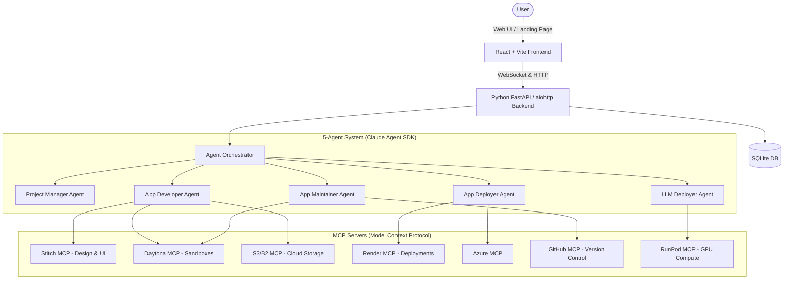
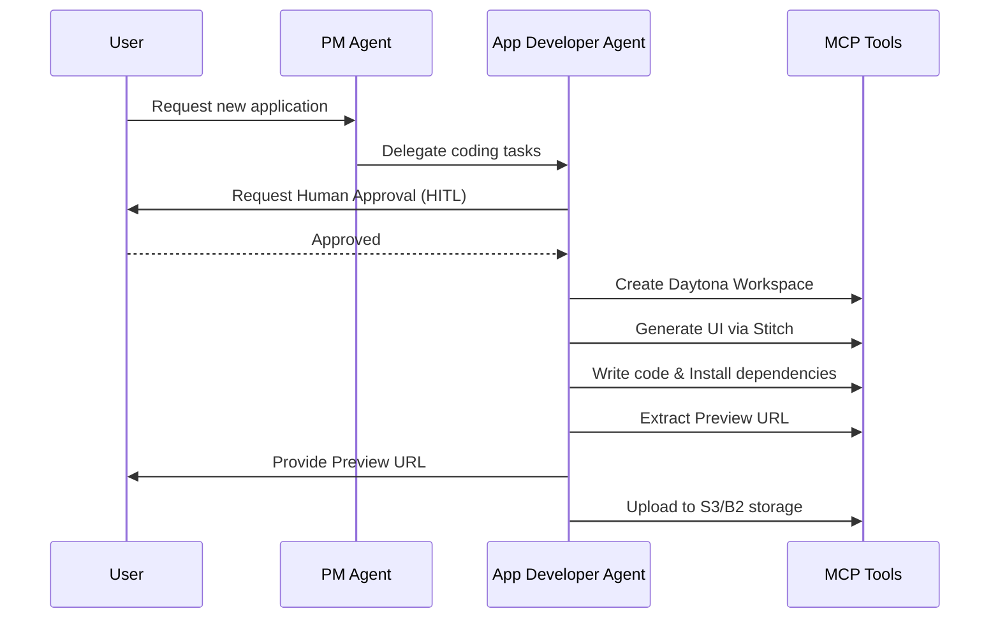
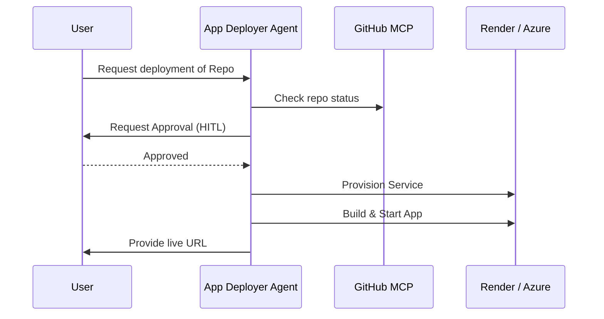

# DELTA Autonomous AI Agents - Architecture

## High-Level System Architecture

```mermaid
graph TD
    User([User]) -->|Web UI / Landing Page| Frontend[React + Vite Frontend]
    Frontend -->|WebSocket & HTTP| Backend[Python FastAPI / aiohttp Backend]
    
    Backend --> Orchestrator[Agent Orchestrator]
    
    subgraph "5-Agent System (Claude Agent SDK)"
        Orchestrator --> PM[Project Manager Agent]
        Orchestrator --> Dev[App Developer Agent]
        Orchestrator --> Deploy[App Deployer Agent]
        Orchestrator --> Maint[App Maintainer Agent]
        Orchestrator --> LLM[LLM Deployer Agent]
    end
    
    subgraph "MCP Servers (Model Context Protocol)"
        Dev --> StitchMCP[Stitch MCP - Design & UI]
        Dev --> DaytonaMCP[Daytona MCP - Sandboxes]
        Dev --> S3MCP[S3/B2 MCP - Cloud Storage]
        
        Deploy --> RenderMCP[Render MCP - Deployments]
        Deploy --> AzureMCP[Azure MCP]
        
        Maint --> GithubMCP[GitHub MCP - Version Control]
        Maint --> DaytonaMCP
        
        LLM --> RunpodMCP[RunPod MCP - GPU Compute]
    end
    
    Backend --> DB[(SQLite DB)]
```

## Agent Workflows

### 1. App Development Workflow

```mermaid
sequenceDiagram
    participant U as User
    participant PM as PM Agent
    participant Dev as App Developer Agent
    participant MCP as MCP Tools
    
    U->>PM: Request new application
    PM->>Dev: Delegate coding tasks
    Dev->>U: Request Human Approval (HITL)
    U-->>Dev: Approved
    Dev->>MCP: Create Daytona Workspace
    Dev->>MCP: Generate UI via Stitch
    Dev->>MCP: Write code & Install dependencies
    Dev->>MCP: Extract Preview URL
    Dev->>U: Provide Preview URL
    Dev->>MCP: Upload to S3/B2 storage
```

### 2. Deployment Workflow

```mermaid
sequenceDiagram
    participant U as User
    participant Deploy as App Deployer Agent
    participant Github as GitHub MCP
    participant Cloud as Render / Azure
    
    U->>Deploy: Request deployment of Repo
    Deploy->>Github: Check repo status
    Deploy->>U: Request Approval (HITL)
    U-->>Deploy: Approved
    Deploy->>Cloud: Provision Service
    Deploy->>Cloud: Build & Start App
    Deploy->>U: Provide live URL
```
